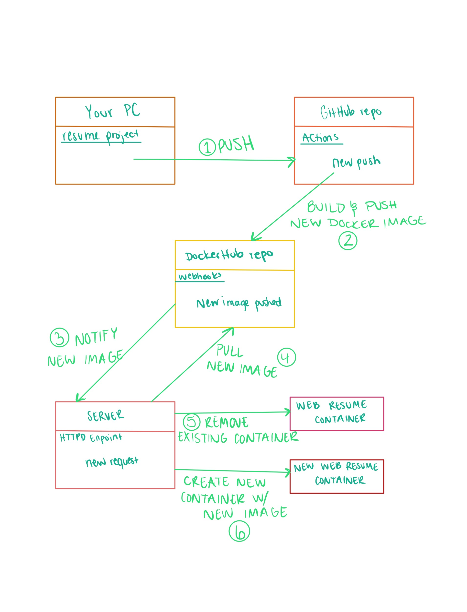

# Project 5
Halie Woods

## Project Overview
- Implement semantic versioning for images using `git tag` metadata in Actions
- Use `webhooks` to keep production up to date

## Part 1 - Semantic Versioning
### Documentation
- How to generate a `tag` in `git` / GitHub
    1. Identify the commit hash that you want to tag using the `git log` command.
    2. Run the following command to create a new tag for the identified commit: `git tag -a tag-name commit-hash -m "tag message"`
    3. Push the new tag to the remote repository on Github by running the following command: `git push origin tag-name`
- Behavior of GitHub workflow
    - what does it do and when
- [Link to Docker Hub repository](https://hub.docker.com/repository/docker/woods245/ceg3120proj4/general)

### Resources
- [Semantic Versioning](https://semver.org/)
- [GitHub - docker/metadata-action](https://github.com/docker/metadata-action)
- [Docker - Manage Tag Labels](https://docs.docker.com/build/ci/github-actions/manage-tags-labels/)

## Part 2 - Deployment
### Documentation

## Part 3 - Diagramming

### Resource
- [Dev Genious](https://blog.devgenius.io/build-your-first-ci-cd-pipeline-using-docker-github-actions-and-webhooks-while-creating-your-own-da783110e151)